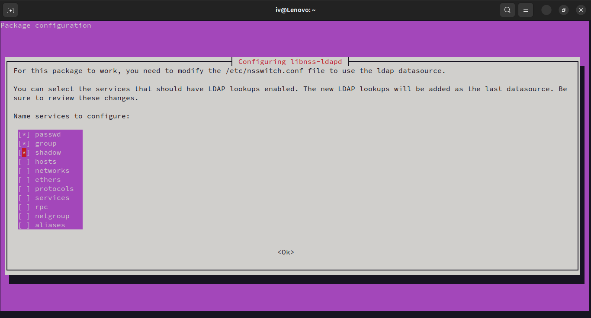
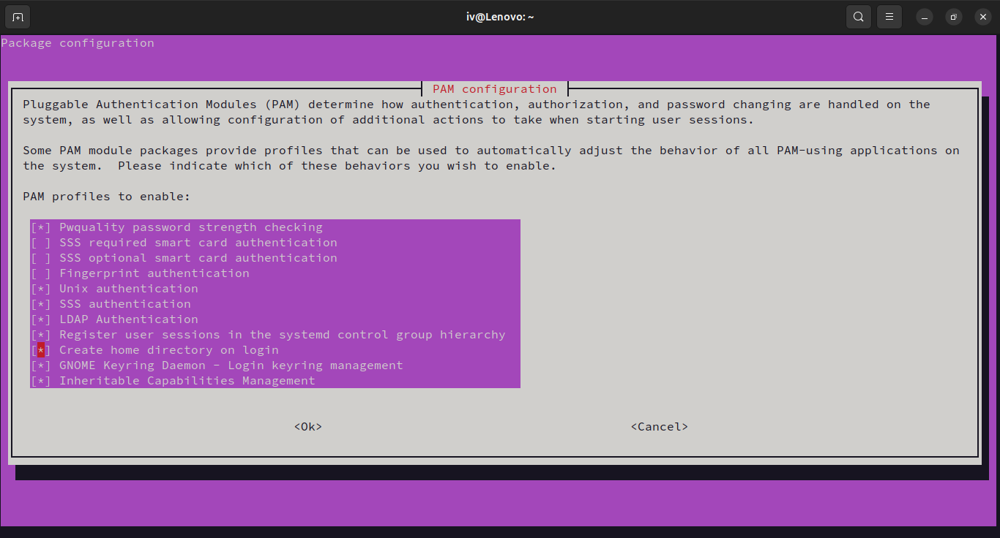

### Proxmox and LDAP Base Installation

Follow the base installation guide for the following before proceeding:

- [Proxmox Virtual Environment Installation](https://www.proxmox.com/en/proxmox-virtual-environment/get-started)
- [LDAP Setup on Debian](https://wiki.debian.org/LDAP/OpenLDAPSetup)
- [LTSP Installation (Server side only)](https://ltsp.org/docs/installation/)

### Configuring LTSP server to use LDAP
Since all of our VMs will mount the home directory from the LTSP server, we need to configure the LTSP server to authenticate users from the LDAP server. Run the following commands to install and configure LDAP client on the LTSP server:

```bash
sudo apt install libpam-ldapd
```
You will be prompted to enter the LDAP server URI, base DN, etc on a TUI prompt. Enter the details and when you reach the following page, select the following options:

1. passwd
2. group
3. shadow



!!! Warning
    Make sure to select the correct options, as selecting the wrong options can cause the server to not authenticate against the LDAP server.

Now for the final step, we can configure the VM to create a home directory for the user if it doesn't exist. Run the following command:

```bash
sudo pam-auth-update
```
Select the option "Create home directory on login" and click "Ok" like so:



!!! Note
    Without this option, the server will not create a home directory for the user if it doesn't exist and the user will get dropped to `/` when they log in.

### LDAP Configuration for Guacamole

Once LDAP is set up, you need to add a custom schema to store virtual machine information, which Guacamole will use to locate available VMs.

1. Head over to the Apache Guacamole [downloads page](https://guacamole.apache.org/releases/1.5.5/) and find the `guacamole-auth-ldap-x.x.x.tar.gz` file. The latest version is `1.5.5` at the time of writing, but download the most recent version available.

2. Extract the tarball. Inside the `schema` folder, you'll find a file named `guacConfigGroup.ldif`.

3. Apply this schema to your LDAP instance with the following command:

    ```bash
    ldapadd -Q -Y EXTERNAL -H ldapi:/// -f schema/guacConfigGroup.ldif
    ```

    You may be prompted to enter the LDAP admin password. Upon success, you should see an output like this:

    ```
    adding new entry "cn=guacConfigGroup,cn=schema,cn=config"
    ```

Now that the schema is in place, you're ready to begin adding virtual machines to LDAP. You can do this either manually using LDIF files or via the [Apache Directory Studio](https://directory.apache.org/studio/). This will be covered in the [Management](management.md) section.

### Installing Guacamole

To deploy Guacamole using Docker, you first need to prepare the necessary database tables.

#### Setting Up Database Tables

Run the following command to launch a temporary Guacamole container that generates SQL scripts for table creation:

```bash
docker run --rm guacamole/guacamole /opt/guacamole/bin/initdb.sh --postgresql > initdb.sql
```
### Docker Compose Setup for Guacamole

1. Create a `compose.yml` file for the deployment. Start by defining the PostgreSQL database service:

    ```yaml
    services:
      db:
        container_name: guacamoledb
        image: postgres:alpine
        restart: unless-stopped
        logging:
            driver: "local"
        environment:
          POSTGRES_PASSWORD: 'dontusethispassword'
          POSTGRES_USER: 'guacuser'
        volumes:
          - pgdata:/var/lib/postgresql/data
    volumes:
      pgdata:
    ```

2. Replace the placeholder password with a secure one, then save the file in a folder and run:

    ```bash
    docker compose up -d
    ```

    This will start the PostgreSQL container.

3. Copy the generated `initdb.sql` file to the PostgreSQL container:

    ```bash
    docker cp initdb.sql guacamoledb:/initdb.sql
    ```

4. Execute the SQL script inside the container to set up the necessary database tables:

    ```bash
    docker exec guacamoledb psql -U guacuser -f /initdb.sql
    ```

Make sure the container name and username match those defined in your `compose.yml` file.

### Completing the Guacamole Setup

Stop the currently running database container to add the rest of the configuration:

```bash
docker compose down
```
Next, append the following services to your existing `compose.yml` file:

```yaml
  guacd:
    container_name: guacd
    image: guacamole/guacd
    restart: unless-stopped
    logging:
      driver: "local"

  guacamole:
    container_name: guacamole
    image: guacamole/guacamole
    restart: unless-stopped
    logging:
      driver: "local"
    ports:
      - 8080:8080
    volumes:
      - ./guacamole-home:/guacamole-home
    environment:
      # Set Apache Tomcat to use / as the Guacamole web context
      WEBAPP_CONTEXT: "ROOT"

      # Directory for custom extensions, duplicated to the container home
      GUACAMOLE_HOME: "/guacamole-home"

      GUACD_HOSTNAME: "guacd"
      POSTGRESQL_HOSTNAME: "guacamoledb"
      POSTGRESQL_DATABASE: "guacuser"
      POSTGRESQL_USER: "guacuser"
      POSTGRESQL_PASSWORD: "dontusethispassword"
      POSTGRESQL_AUTO_CREATE_ACCOUNTS: "true"

      # LDAP configuration (adjust to match your setup)
      LDAP_HOSTNAME: "191.168.111.222"
      LDAP_PORT: 389
      LDAP_USER_BASE_DN: "ou=people,dc=example,dc=com" # Users available for login
      LDAP_CONFIG_BASE_DN: "ou=groups,dc=example,dc=com" # Virtual machines available for use

      # Enable 2FA (if desired)
      # TOTP_ENABLED: "true"
    depends_on:
      - guacdb
      - guacd
```
The final `compose.yml` file should resemble the following:

```yaml
services:
  db:
    container_name: guacamoledb
    image: postgres:alpine
    restart: unless-stopped
    logging:
        driver: "local"
    environment:
      POSTGRES_PASSWORD: 'dontusethispassword'
      POSTGRES_USER: 'guacuser'
    volumes:
      - pgdata:/var/lib/postgresql/data
  guacd:
    container_name: guacd
    image: guacamole/guacd
    restart: unless-stopped
    logging:
      driver: "local"

  guacamole:
    container_name: guacamole
    image: guacamole/guacamole
    restart: unless-stopped
    logging:
      driver: "local"
    ports:
      - 8090:8080
    volumes:
      - ./guacamole-home:/guacamole-home
    environment:
      WEBAPP_CONTEXT: "ROOT"
      GUACAMOLE_HOME: "/guacamole-home"
      GUACD_HOSTNAME: "guacd"
      POSTGRESQL_HOSTNAME: "guacamoledb"
      POSTGRESQL_DATABASE: "guacuser"
      POSTGRESQL_USER: "guacuser"
      POSTGRESQL_PASSWORD: "dontusethispassword"
      POSTGRESQL_AUTO_CREATE_ACCOUNTS: "true"
      LDAP_HOSTNAME: "191.168.111.222"
      LDAP_PORT: 389
      LDAP_USER_BASE_DN: "ou=people,dc=example,dc=com"
      LDAP_CONFIG_BASE_DN: "ou=groups,dc=example,dc=com"
    depends_on:
      - guacdb
      - guacd
volumes:
  pgdata:

```
Now you can start the Guacamole services:

```bash
docker compose up -d
```
You will now be able to access Guacamole at `http://your-server-ip:8080`. If you have a domain name, you can set up a reverse proxy to point to the Guacamole service.

## Next Steps
Head over to [Configuration](configuration.md) to finalize some more configurations before we can use the system
