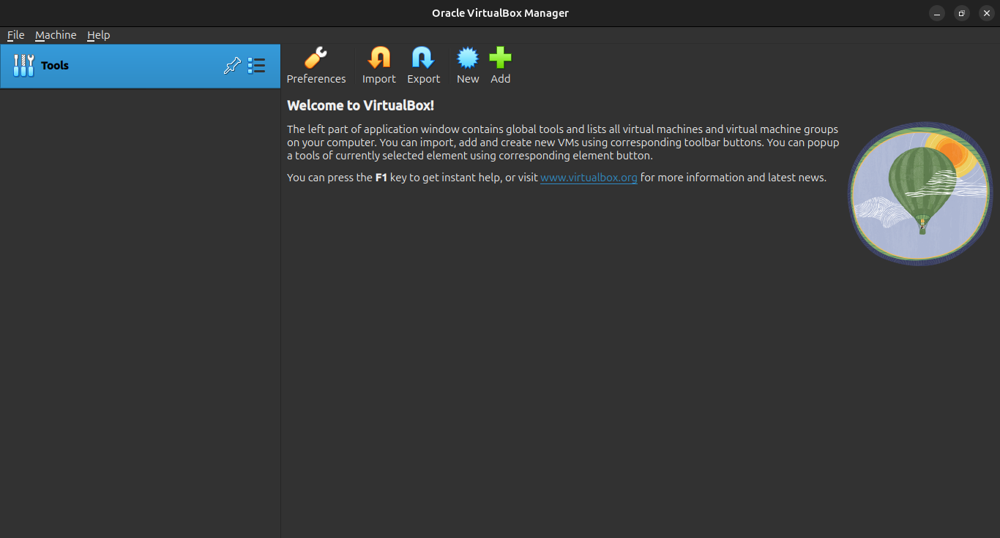
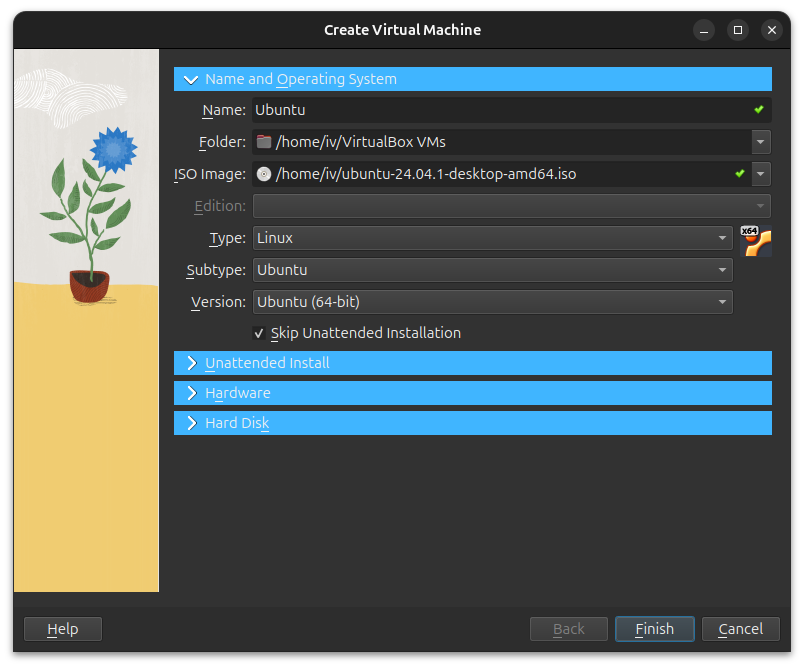
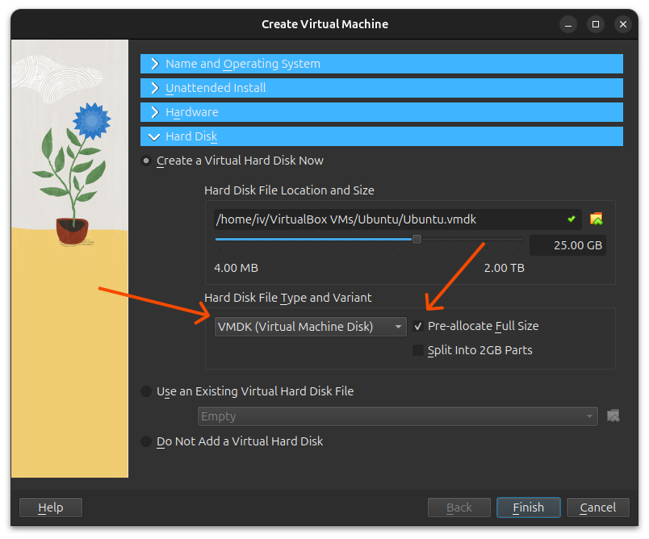
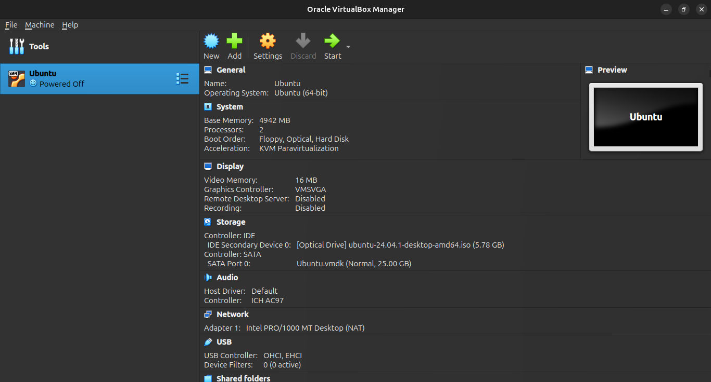
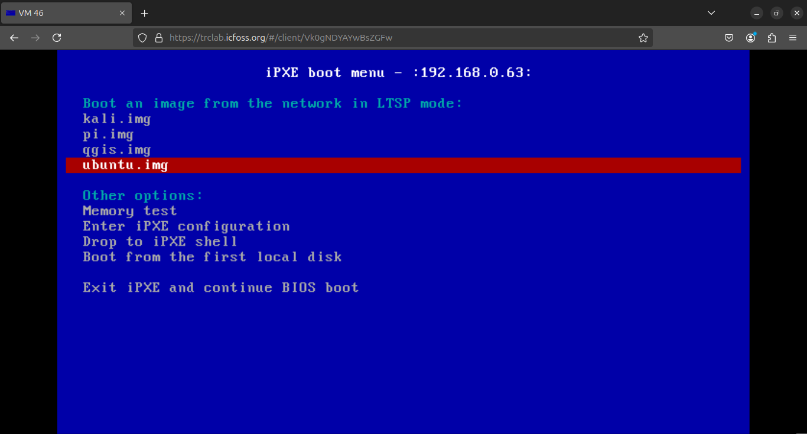

Now that we have the platform ready to use, the only thing missing is some LTSP images which can be used by our newly created VMs to boot off of.

## Creating LTSP Images
LTSP provides 3 ways to create images:

1. Chrootless: use the server root (/) as the template for the clients
2. Raw virtual machine image: graphically maintain e.g. a VirtualBox VM.
3. Chroot: manually maintain a chroot directory using console commands.

We will be going with the second option, as it is the most straightforward and easy to maintain.

### Installing VirtualBox
!!! Info

    The following instructions are supposed to be executed on the LTSP server.

First, we need to install VirtualBox. You can download the latest version from the [official website](https://www.virtualbox.org/wiki/Linux_Downloads). cd to the directory where the downloaded file is located and run the following command:

```bash
sudo apt install ./<downloaded_file>.deb
```
!!! Note

    - Make sure to add your user to the `vboxusers` group by running the following command and logging out and back in:
    ```bash
    sudo usermod -aG vboxusers $USER
    ```
    - Make sure you have virtualization enabled in your BIOS settings.
Once installed, open it up. You should see a window like this:


!!! Tip
    If you were prompted to choose between expert mode and basic mode, choose expert mode.


Click on the "New" button to create a new VM. You should see a window like this:


Customize it to your liking and expand the "Hard disk" section. LTSP require VMDK images with preallocated space, so make sure to select "VMDK" and "Pre-allocate Full Size" as shown below:



Click on "Create" and you should see a window like this:



Start up the VM and go through the installation process. Once you are done, you should have a VM ready to be used as an LTSP image. You may also install any additional software you want to be included in the image.

### Installing LTSP Client
Now that we have a VM ready, we need to install LTSP on it. Boot up the VM and run the following commands:

```bash
sudo apt update
sudo add-apt-repository ppa:ltsp
sudo apt update
sudo apt install --install-recommends ltsp epoptes-client
```
This is standard LTSP client installation. You can find more information on how to configure LTSP [here](https://ltsp.org/docs/installation/).

### Installing and Configuring LDAP
Since we are using LDAP to authenticate users when they log in to the VM, we need to install and configure LDAP on the VM also. Follow the same steps as you did on the LTSP server to [install and configure LDAP](installation.md#configuring-ltsp-server-to-use-ldap) on the VM, but you may skip the `pam-auth-update` step as it is not required on the client.

### Exporting the VM as an LTSP Image
Once you are done with the configuration, shut down the VM and export it as an LTSP image. Run the following command to export the VM:

```bash
sudo ln -s "/home/user/VirtualBox VMs/ubuntu/ubuntu-flat.vmdk" /srv/ltsp/ubuntu.img
ltsp image ubuntu
```
Replace `/home/user/VirtualBox VMs/ubuntu/ubuntu-flat.vmdk` with the path to your VM's VMDK file. The second command creates an LTSP image from the VMDK file.

!!! Note
    Note that we are using the `xx-flat.vmdk` file instead of the regular one. this is because LTSP requires the actual disk image with pre-allocated space to create an LTSP image. The `flat` in the filename indicates that the disk is pre-allocated.

It should take a couple of minutes to complete the process. Follow the guide over at [LTSP - Maintaining client images](https://ltsp.org/docs/installation/#maintaining-a-client-image) for more information on how to create LTSP images.

### Adding the LTSP Image to the LTSP boot menu
After you create your initial image, or if you ever create additional images, run the following command to generate an iPXE menu and copy the iPXE binaries in TFTP:

```bash
ltsp ipxe
```

Once done, all of the proxmox VMs are ready to boot off of the LTSP server. Launch apache guacamole on a browser and login with the credentials you set up earlier. You should see the VMs listed on the left side of the screen or go straight to VNC depending on the number of VMs assgined to the user. Click on any of them to start the VM. You should see the VM booting off of the LTSP server.




That's it! You now have a working LTSP server with LDAP and Guacamole integration. You can create more LTSP images and go through the same process to add them to the server.

## Next Steps
- [Quirks and workarounds](quirks.md)