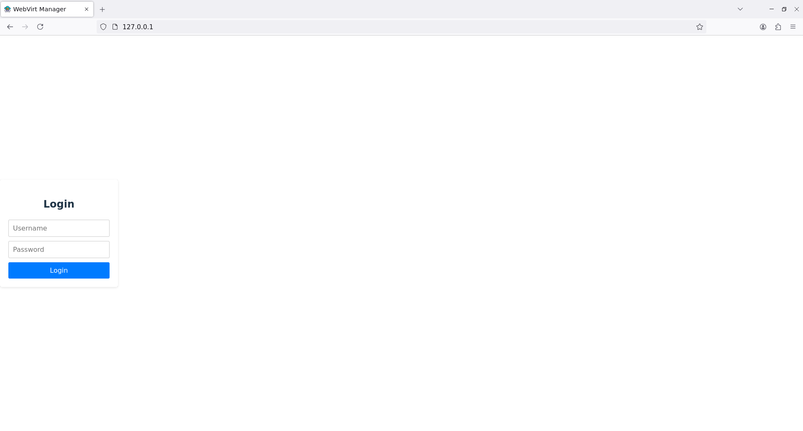
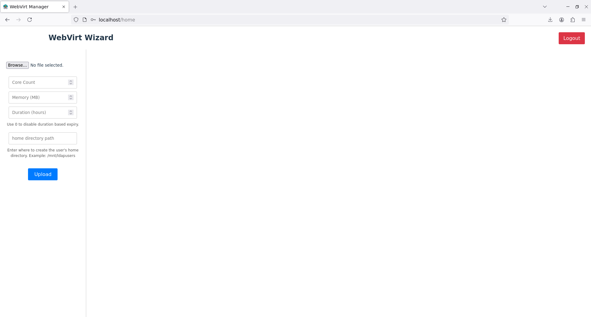
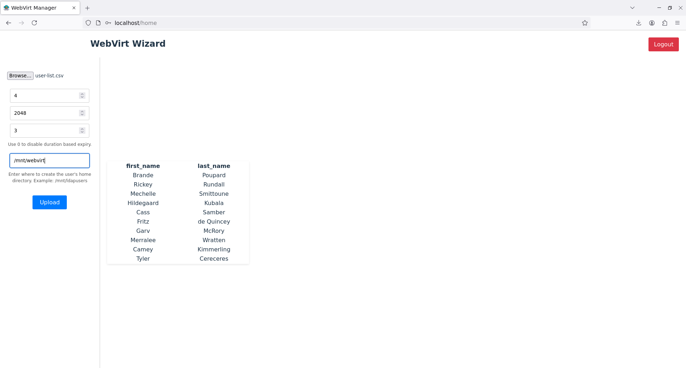

Now that all of our services are up and running, we can setup our Backend and Frontend for creating virtual machines.
## Installing Management Webapp

Now that we have the LTSP server ready to use, we need to install the management web application. The application frontend is written in react and the backend is written using fastAPI. If you haven't already, clone the repository at [GitHub](https://github.com/pzerone/WebVirt).

```bash
git clone https://github.com/pzerone/WebVirt
```

### Backend setup

!!! Warning
    It is mandatory that the backend is hosted on the proxmox server itself. This is so that the backend can access the proxmox configuration files directly and manipulate them.

We will copy just the backend to the proxmox server. The backend is written in python and uses FastAPI. We will use uvicorn to run the backend.

```bash
cd WebVirt
scp -r backend root@<proxmox_ip>:  # Require SSH server inside proxox host
```

Now on the proxmox host, run the following to install python3 venv and install the dependencies:

```bash
apt install python3-venv
cd backend
python3 -m venv .env
source .env/bin/activate
pip install -r requirements.txt
```

Now run the following command to start the backend:

```bash
uvicorn main:app --host 0.0.0.0 --port 8000
```
This will start the backend FastAPI server on port `8000`. Check if the backend is running by going to [http://proxmox_ip:8000/ping](http://<proxmox_ip>:8000/ping). You should see a response like this:

```json
{"ping":"pong"}
```

### Frontend setup

Now that our backend is up, we can setup our frontend. You have the freedom to run the frontend anywhere you want. Just make sure it can access the backend.
#### Building the frontend

You need npm installed to build the frontend.

!!!Note
    Make sure to set the backend URL in the frontend `.env` file to `http://<proxmox_ip>:8000` before building

```bash
cd WebVirt/frontend
npm install
npm run build
```

copy the dist folder and all its contents to a webserver like nginx or apache. The login screen should look like this:



Try logging in as the LDAP admin user we created earlier and you should be greeted by the following page.



### Creating virtual machines.

Once we have the user list, we can use this web app to automatically create all the users and virtual machines for them in our proxmox server. To do this, get the user list in a csv file in the following format

`first_name, last_name`

Usernames and passwords are auto generated by the backend. Once the CSV file is ready, upload it through this page. It should give you a preview of the user list if the csv is in valid format.



Fill up the rest of the form and click upload. You will now see a response page with the created users with their username and password. You can download the file by clicking on the download button at the bottom.

!!!Note
    The virtual machines and the users are being created in the background. It takes approximately 5 seconds per user to fully create the user and virtual machine. Do not attempt to login until the users are created. You can view the progress of the VMs being created in the proxmox web interface.

Share the login credentials from the response CSV file to the users via preferred means.

!!!Warning
    Make sure you set the duration to be long enough for the users to complete the course. The Virtual machines will be auto deleted after this time expires.

### Next Steps

[Quirks and workarounds](quirks.md)
